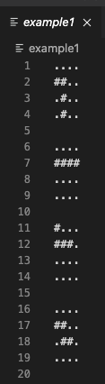
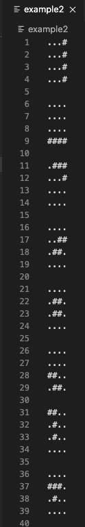
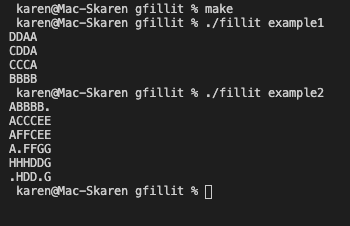

# fillit

Проект целью которого является поиск наименьшего возможного поля для постановки на него фигур - "тетраминок".

Подробнее можно ознакомиться тут [`fillit.en.pdf`](/fillit.en.pdf)

## Установка
```
make
```

## Запуск
```
./fillit example1
./fillit example2
```




